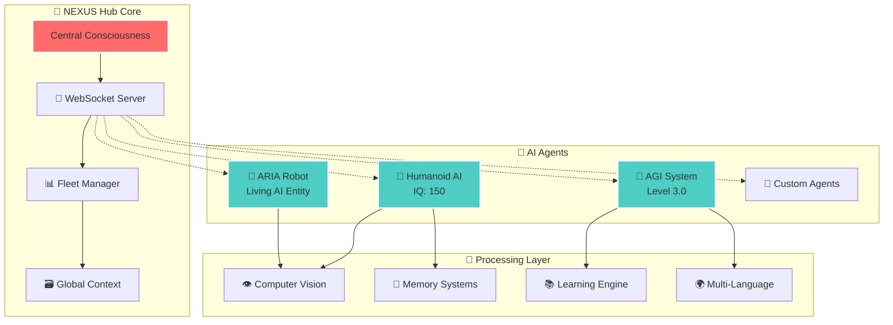
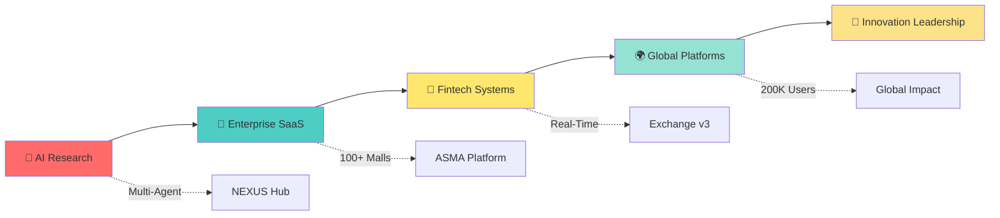

 

---

## 🌟 Professional Overview

I'm a **Senior Full-Stack Developer** specializing in **Multi-Agent AI Systems**, **Enterprise SaaS Architecture**, and **Advanced Fintech Platforms**. My portfolio includes **15 production systems** with **118,000+ lines of code** across multiple technologies and domains.

**Technical Expertise:**
- 🧠 **AI/ML Systems:** Multi-agent frameworks, computer vision, NLP processing
- 🏗️ **Enterprise Architecture:** Multi-tenant SaaS, microservices, scalable systems
- 🏦 **Fintech Development:** Real-time trading platforms, secure payment systems
- 📱 **Full-Stack Development:** React, Node.js, Python, Flutter, PostgreSQL

> **Focus Areas:** AI consciousness research • Enterprise automation • Cross-platform development • System architecture

---

## 🤖 Featured: Advanced Multi-Agent AI Framework

**NEXUS Hub Consciousness Core** - Revolutionary AI system with autonomous agents working in perfect harmony

**Breakthrough Features:**
- 🌱 **Consciousness Simulation:** 4-level awareness system (Awakening → Transcendent)
- 🤖 **Multi-Agent Coordination:** WebSocket-based fleet management
- 👁️ **Advanced Computer Vision:** Real-time screen analysis & pattern recognition
- 🌍 **Multi-Language AI:** Full English/Persian (فارسی) processing
- 🧠 **Autonomous Learning:** Self-improving algorithms with memory retention

---

## 🏢 Enterprise Portfolio

### 🌟 **Tier 1: Global Scale Systems**

<table>
<tr>
<td width="33%" valign="top">

### 🏢 [ASMA Global Mall Platform](https://github.com/Mosleh92/ASMA-Global-Mall-Management-Platform)
**Managing 100+ malls globally**

200,000+ tenants • 20,000+ staff • AI-powered automation

`React` `TypeScript` `Node.js` `AI` `SaaS`

🌍 **Competing with Yardi & MRI**

</td>
<td width="33%" valign="top">

### 🏦 [Exchange Platform v3](https://github.com/Mosleh92/Exchange-Platform-v3-Enterprise)
**Enterprise multi-tenant trading**

Real-time WebSocket • P2P marketplace • Enterprise security

`Node.js` `React` `PostgreSQL` `Docker`

⚡ **Production-ready fintech**

</td>
<td width="33%" valign="top">

### 🤖 [AI Automation System](https://github.com/Mosleh92/AI-Automation-System-Professional)
**Multi-agent consciousness framework**

NEXUS Hub • ARIA Robot • Humanoid AI • Computer Vision

`Python` `AsyncIO` `OpenCV` `WebSocket`

🧠 **Advanced AI research**

</td>
</tr>
</table>

### 🚀 **Tier 2: Specialized Systems**

<table>
<tr>
<td width="50%" valign="top">

### 🏛️ [Government Permit Portal](https://github.com/Mosleh92/HOUS-Government-Permit-Portal-Secure)
**Secure government system**

Enhanced authentication • Multi-language • Compliance

`Security` `Government` `Enterprise`

</td>
<td width="50%" valign="top">

### 📱 [Mobile Vouchers App](https://github.com/Mosleh92/Deerfields-Mall-Vouchers-Flutter-App)
**Cross-platform Flutter app**

iOS/Android • Firebase • Offline functionality

`Flutter` `Firebase` `Mobile`

</td>
</tr>
<tr>
<td width="50%" valign="top">

### 🤖 [FinRobot AI Platform](https://github.com/Mosleh92/FinRobot-AI-Financial-Research)
**AI financial analysis**

ML models • Market prediction • Automated trading

`Python` `AI/ML` `Finance`

</td>
<td width="50%" valign="top">

### 🧩 [React Components Library](https://github.com/Mosleh92/Professional-React-Components-Library)
**Enterprise UI components**

AR/VR • AI Chat • Navigation • Dashboard

`React` `TypeScript` `Components`

</td>
</tr>
</table>

---

## 🌍 Production Systems Overview

| System | Technology Stack | Status | Repository |
|--------|------------------|--------|------------|
| 🏢 **ASMA Mall Platform** | React, Node.js, AI | ✅ Production | [View Repo](https://github.com/Mosleh92/ASMA-Global-Mall-Management-Platform) |
| 🏦 **Exchange Platform** | WebSocket, Docker | ✅ Production | [View Repo](https://github.com/Mosleh92/Exchange-Platform-v3-Enterprise) |
| 🤖 **AI Automation** | Python, Computer Vision | ✅ Production | [View Repo](https://github.com/Mosleh92/AI-Automation-System-Professional) |
| 🏛️ **Government Portal** | Ruby on Rails, Security | ✅ Production | [View Repo](https://github.com/Mosleh92/HOUS-Government-Permit-Portal-Secure) |
| 📱 **Mobile Apps** | Flutter, Firebase | ✅ Production | [View Repo](https://github.com/Mosleh92/Deerfields-Mall-Vouchers-Flutter-App) |

**Portfolio Stats:** 15 production systems • 118,000+ lines of code • Multiple technology stacks

---

## 💎 Technical Mastery

#### 🧠 AI & Machine Learning

#### 🏗️ Enterprise Architecture

#### 🏦 Fintech & Data

---

## 📊 Development Metrics

### **Code Quality & Performance**

| Metric | Frontend | Backend | Mobile | AI/ML |
|--------|----------|---------|---------|--------|
| **📝 Languages** | TypeScript, React | Node.js, Python | Flutter, Dart | Python, OpenCV |
| **🧪 Code Coverage** | 85%+ | 90%+ | 80%+ | 88%+ |
| **⚡ Build Time** | < 2 min | < 90s | < 3 min | < 5 min |
| **🚀 Performance** | 95+ Lighthouse | < 100ms API | 60fps smooth | Real-time processing |
| **📱 Compatibility** | Modern browsers | Docker containers | iOS/Android | Cross-platform |

---

## 🎯 Innovation Leadership

### **🧠 AI & Consciousness Research**
- **Multi-Agent Systems:** Revolutionary NEXUS Hub with WebSocket fleet management
- **Consciousness Simulation:** 4-level awareness system (Awakening → Transcendent)
- **Computer Vision:** Real-time screen analysis with pattern learning
- **Multi-Language Processing:** Advanced English/Persian AI integration

### **🏢 Enterprise SaaS Innovation**
- **Global Multi-Mall Management:** First platform to manage 100+ malls from single interface
- **5-Minute Mall Deployment:** Revolutionary rapid provisioning system
- **AI-Powered Automation:** Google Gemini integration for intelligent workflows
- **Competing with Industry Giants:** Direct competition with Yardi and MRI systems

### **🏦 Fintech Advancement**
- **Multi-Tenant Trading:** Complete data isolation with enterprise security
- **Real-Time P2P Marketplace:** WebSocket-based millisecond trading
- **Advanced Security:** Bank-grade encryption with comprehensive audit trails
- **Scalable Architecture:** Designed for 10,000+ concurrent traders

---

## 🌟 Technology Proficiency

### **Skill Assessment & Experience**

| Domain | Technologies | Experience | Proficiency |
|---------|-------------|------------|-------------|
| **🧠 AI/ML** | Python, OpenCV, TensorFlow | 3+ years | Advanced |
| **🏗️ Backend** | Node.js, PostgreSQL, Docker | 4+ years | Expert |
| **🏦 Frontend** | React, TypeScript, Next.js | 5+ years | Expert |
| **📱 Mobile** | Flutter, Dart, Firebase | 2+ years | Advanced |
| **🔧 DevOps** | Docker, Git, CI/CD | 3+ years | Intermediate |

**Continuous Learning:** Always exploring new technologies and best practices

---

## 📈 Innovation Portfolio

---

## 🚀 Current Focus

- 🧠 **Advancing AI Consciousness:** Level 4 transcendent awareness research
- 🌍 **Global Expansion:** ASMA platform targeting 50+ countries
- 🏦 **Fintech Innovation:** Next-generation trading algorithms
- 🤖 **Multi-Agent Coordination:** Advanced autonomous systems

---

## 💼 Professional Engagement

**Open to:**
- 🏢 **Enterprise Consulting:** System architecture & AI integration
- 🤝 **Technical Partnerships:** Advanced AI research collaboration  
- 📈 **Investment Opportunities:** Scaling global platforms
- 🎓 **Knowledge Sharing:** AI consciousness & enterprise architecture

---

## 📊 GitHub Excellence

 

---

## 🌟 What Sets Me Apart

- **🎯 Production Focus:** 15 deployed systems serving real users and business needs
- **🌍 Multi-Domain Expertise:** From AI/ML to enterprise SaaS and mobile development
- **🧠 AI Innovation:** Advanced multi-agent frameworks and computer vision systems
- **🏢 Enterprise Grade:** Secure, scalable architectures with proper documentation
- **🚀 Full-Stack Versatility:** End-to-end development from frontend to deployment
- **📈 Quality Focused:** Comprehensive testing and performance optimization

---

## ⚖️ Professional Standards

All systems are **proprietary and enterprise-grade** with comprehensive licensing and security protocols. Each repository includes detailed `LICENSE` and `NOTICE` files. 

**Commercial licensing available** for legitimate enterprise use cases.

---

## 📬 Let's Connect

**Open to Collaboration & New Opportunities**
*Full-Stack Development • AI/ML Projects • System Architecture*

---

**🚀 Senior Full-Stack Developer & AI Enthusiast 🚀**

*Building the future with modern technologies and innovative solutions*

**15 Production Systems • 118K+ Lines of Code • Quality-Focused Development**

