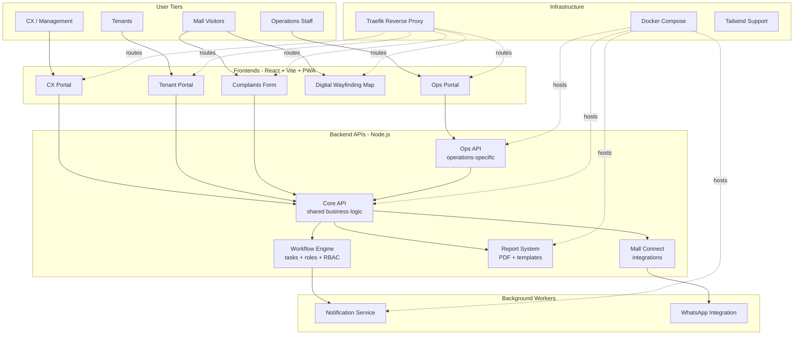

 

---

## 🧑‍💻 About Me

I'm a **full-stack engineer and system architect** who builds **enterprise-grade software that actually ships to production**. My portfolio includes a **15-service microservices architecture** powering a major shopping mall, **multi-tenant SaaS platforms** for the SMB market, and **fintech infrastructure** for currency exchange operators.

I work end-to-end: data model → API → frontend → DevOps → live deployment.

> **Currently open to:** white-label licensing • freelance engagements • technical partnerships

---

## 🏗️ Featured Architecture — Enterprise Mall Operations Platform

A **15-microservice ecosystem** I designed and built for a major UAE shopping mall. Spans operations, CX, tenants, reporting, notifications, wayfinding, and complaints — all production-deployed under a Docker Compose + Traefik infrastructure.

> 📐 **[Read the full architecture blueprint →](https://github.com/Mosleh92/enterprise-mall-architecture)**

**Tech:** Node.js · TypeScript · React · Vite · PWA · Tailwind · Redis · Docker · Traefik · WhatsApp API

---

## 🚀 Public Projects

<table>
<tr>
<td width="50%" valign="top">

### 🏬 [Enterprise Mall Architecture](https://github.com/Mosleh92/enterprise-mall-architecture)
**Blueprint of a 15-service production system**

Real architecture documentation • Mermaid diagrams • Service decomposition

`Architecture` `Microservices` `Enterprise` `Case-Study`

📐 Case study of real client work

</td>
<td width="50%" valign="top">

### 🏦 [Exchange Platform](https://github.com/Mosleh92/exchange-platform)
**Multi-tenant currency exchange & P2P trading**

Real-time WebSocket trading • Role-based access • KYC + escrow

`Node.js` `React` `PostgreSQL` `Supabase` `WebSocket`

⭐ Has community star

</td>
</tr>
<tr>
<td width="50%" valign="top">

### 🏬 [MallOS Enterprise](https://github.com/Mosleh92/mallos-enterprise)
**AI + IoT mall management system**

2FA multi-role auth • Real-time monitoring • Predictive analytics

`TypeScript` `Node.js` `AI` `IoT`

</td>
<td width="50%" valign="top">

### 🎮 [MallQuest](https://github.com/Mosleh92/MallQuest)
**Hamster-Kombat-style gamification for malls**

4 dashboards • Bilingual (AR/EN) • Real-time reward engine

`Python` `Gamification` `Bilingual` `Real-time`

</td>
</tr>
</table>

---

## 💼 Private Client Work

A summary of production systems delivered under client agreements. Code is private; happy to walk through architecture on request.

| System | Type | Stack |
|---|---|---|
| 🏬 **Mall Operations Platform** | 15-service architecture | Node.js, TypeScript, React, Docker, Traefik |
| 🎫 **Vouchers System** | Full-stack (backend + frontend + mobile) | JavaScript / Node.js |
| 🏘️ **Leasing Management System** | SaaS for real-estate operators | JavaScript / Node.js |
| 🚀 **BizKuasa** | Multi-tenant SaaS (Indonesia) | Node.js, PostgreSQL, Redis |
| 🤖 **WhatsApp Automation** | AI-powered customer engagement | Baileys, Groq, Ollama |

---

## 🛠️ Tech Stack

#### Languages

#### Frameworks & Frontend

#### Data & Infrastructure

#### AI & Integrations

---

## 📊 GitHub Stats

 

---

## 💼 What I Build For Clients

- **Multi-tenant SaaS backends** — auth, billing, admin tooling, RBAC
- **Microservices architectures** — service boundaries, message queues, infra topology
- **Payment integrations** — PayPal, Xendit, Stripe, crypto, P2P escrow
- **Real-time platforms** — WebSocket + Redis-backed dashboards
- **AI integration layers** — Groq, Ollama, OpenAI, LLaVA
- **Enterprise portals** — React + Vite + PWA frontends, role-aware UX
- **End-to-end Docker deployments** — production-grade on any VPS

---

## ⚖️ A Note on Code Use

All code in this account is **proprietary and copyrighted**. Each repository ships with a `LICENSE` and `NOTICE` declaring terms. Reading, studying, and pattern reference are welcome; commercial use, redistribution, and derivative works require explicit licensing.

If you want to use any of this in your business, **let's talk** — terms are reasonable for legitimate use cases.

---

## 📬 Get In Touch

**Open to:** Freelance engagements · White-label licensing · Technical partnerships

---

⭐ *If any of these projects look interesting, give one a star — it really helps!*

